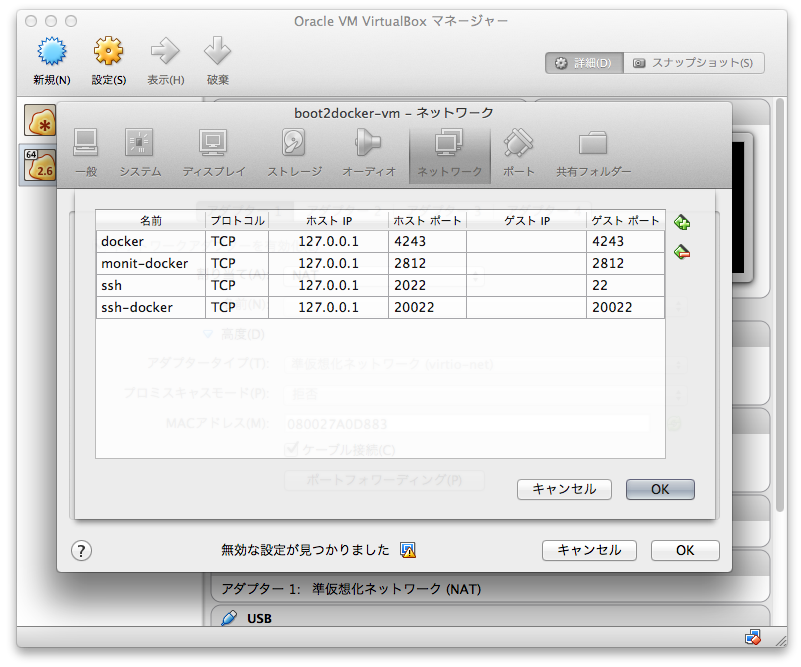

dockerfile-development-db
=========================


### prepare

```
$ brew install docker boot2docker
$ boot2docker init
```

### build

```
$ rake container:build
```

then build `test_image`

### run container

```
$ docker run -d -p 20022:22 -p 2812:2812 -p 3306:3306 -p 11211:11211 -p 6379:6379 --name test_d -t test_image
```

### memo


